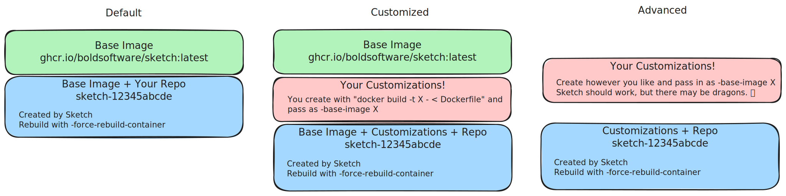

# Docker Containers

## Why!?!

To support multiple Sketch sessions in parallel, and to give the sessions
isolation, each Sketch session runs in its own container. (At the end of the
day, the output of a Sketch session is new git commit(s).)

## Customization

*Customizing Sketch's containers*

By default, Sketch uses a Docker container generated by
[https://github.com/boldsoftware/sketch/blob/main/dockerimg/Dockerfile.base](https://github.com/boldsoftware/sketch/blob/main/dockerimg/Dockerfile.base)
and published to
[https://github.com/boldsoftware/sketch/pkgs/container/sketch](https://github.com/boldsoftware/sketch/pkgs/container/sketch).
This container is based on Ubuntu 24.04 and contains many popular tools. Sketch
will install additional tools as it needs.

Locally, Sketch creates a container image based on the default that includes
your working tree. This image is cached (identified by a container label that
is a hash of your working tree directory and the base image id) to speed up
starting up Sketch. (Future invocations do a "git reset" inside the image, but
don't need to copy over the whole git repo.) You can force re-creation with the
`-force-rebuild-container` flag.

If you'd like to customize the container, specify `-base-image` and
point Sketch to an image you've built. We recommend layering your customizations
on top of our base image, but this is not strictly necessary. Sketch will then
add your repo on top of it, at runtime.



For example, if you want to add Node 22, you might create a Dockerfile
like below, and build it with `docker build -t sketch-with-node-22 - < Dockerfile.sketch`,
and pass it to sketch with `-base-image sketch-with-node-22`.

```dockerfile
FROM ghcr.io/boldsoftware/sketch:latest

RUN apt-get update && \
    apt-get install -y curl && \
    curl -fsSL https://deb.nodesource.com/setup_22.x | bash - && \
    apt-get install -y nodejs && \
    apt-get clean && \
    rm -rf /var/lib/apt/lists/*
```

## Troubleshooting

"no space left on device"

`docker system prune -a` removes stopped containers and unused images, which usually frees up significant disk space.
