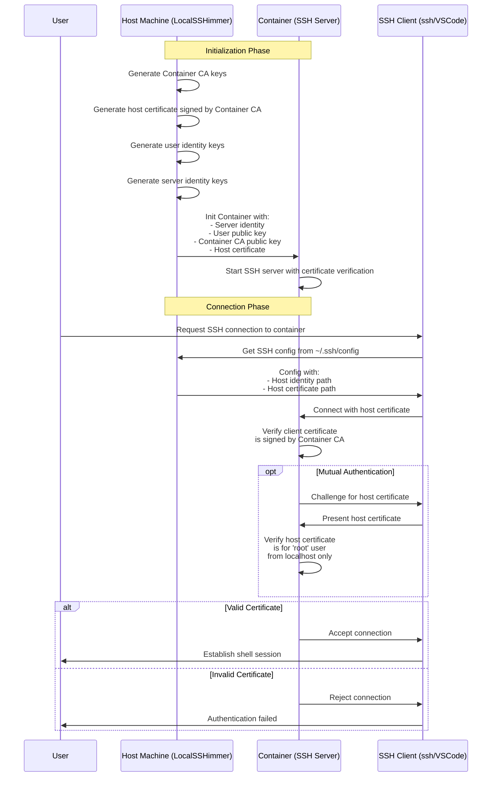

# Sketch SSH Mutual Authentication System

This document describes how the Sketch SSH system implements mutual authentication between the host machine and containers using certificate-based authentication.

## Architecture Overview

The Sketch SSH system uses a certificate-based approach to establish mutual trust between the host machine and containers. This ensures that:

1. Host verifies container identity: The user can trust that they're connecting to the intended container
2. Container verifies host identity: The container can trust that connections are coming from authorized host machines

## Component Interaction Diagram

## Security Features

### Certificate-Based Authentication

- **Container CA**: A dedicated Certificate Authority for Sketch containers
- **Host Certificates**: Signed by the Container CA, authorizing specific hosts to connect
- **CA-Based Known Hosts**: Uses `@cert-authority localhost,127.0.0.1,[::1]` directive to trust only localhost certificates
- **Certificate Constraints**:
  - Valid only for 'root' user (the container user)
  - Source address restricted to localhost (127.0.0.1, ::1)
  - Limited validity period (30 days by default)

### Security Benefits

1. **Defense in Depth Security**:
   - Multiple layers of protection:
     - Certificates require CA signature
     - CA authority is restricted to localhost addresses only
     - Certificate constraints limit to localhost source addresses
   - Even if the CA key is compromised, it can only be used for localhost connections
   - Even if SSH ports are exposed, unauthorized connections are rejected

2. **Localhost Restriction**:
   - Host certificates only work from the local machine, preventing remote exploitation

3. **Seamless User Experience**:
   - Certificate management happens automatically, requiring no user intervention

## Implementation Components

- **LocalSSHimmer**: Manages certificate generation and SSH configuration on the host
- **Custom SSH Server**: Enforces certificate validation in the container
- **SSH Client Configuration**: Automatically configured to use the right certificates

## Key Files

- `~/.config/sketch/container_ca`: Container CA private key
- `~/.config/sketch/container_ca.pub`: Container CA public key
- `~/.config/sketch/host_cert`: Host certificate signed by Container CA
- `~/.config/sketch/container_user_identity`: User identity for SSH connections
- `~/.config/sketch/container_server_identity`: Server identity for container SSH server

## SSH Configuration Approach

### Hybrid Configuration Model

LocalSSHimmer uses a hybrid approach to balance security and practicality:

1. **Localhost-Restricted CA Trust** for host verification:
   - A single `@cert-authority localhost,127.0.0.1,[::1]` entry in known_hosts
   - Only trusts certificates for localhost addresses
   - Prevents CA misuse even if keys are compromised
   - Simplifies management of multiple containers
   - Provides strong cryptographic verification

2. **Individual Host Entries** in SSH config:
   - Each container still needs a dedicated entry for port configuration
   - This is necessary because SSH doesn't support wildcards for ports
   - Container-specific entries use shared identity files and certificates

This approach maintains the convenience of "ssh container-name" commands while leveraging the security benefits of certificate-based authentication.

## Cleanup Behavior

The system is designed to support multiple concurrent Sketch instances:

- **Container-Specific Cleanup**: When a Sketch instance exits, it only removes its own container's entries from the SSH configuration
- **Preserved CA Authority**: Certificate authority entries are preserved during cleanup since they may be used by other running containers
- **Independent Host Certificates**: Each Sketch instance maintains its own host certificate

This approach allows multiple Sketch instances to run concurrently while preserving the security benefits of certificate-based authentication.