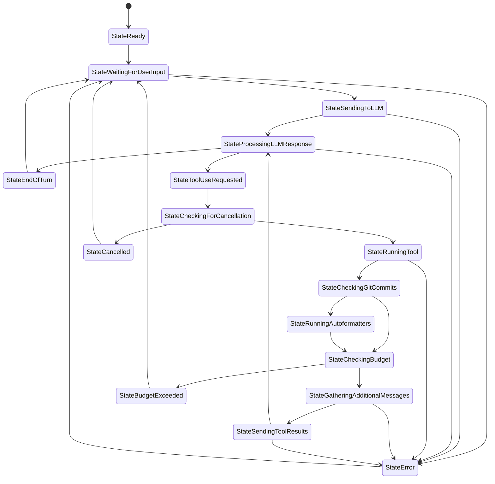

# Agent State Machine Diagram

## State Descriptions

| State | Description |
|-------|-------------|
| StateReady | Initial state when the agent is initialized and ready to operate |
| StateWaitingForUserInput | Agent is waiting for a user message to start a turn |
| StateSendingToLLM | Agent is sending message(s) to the LLM |
| StateProcessingLLMResponse | Agent is processing a response from the LLM |
| StateEndOfTurn | Processing completed without tool use, turn ends |
| StateToolUseRequested | LLM has requested to use a tool |
| StateCheckingForCancellation | Agent checks if user requested cancellation |
| StateRunningTool | Agent is executing the requested tool |
| StateCheckingGitCommits | Agent checks for new git commits after tool execution |
| StateRunningAutoformatters | Agent runs code formatters on new commits |
| StateCheckingBudget | Agent verifies if budget limits are exceeded |
| StateGatheringAdditionalMessages | Agent collects user messages that arrived during tool execution |
| StateSendingToolResults | Agent sends tool results back to the LLM |
| StateCancelled | Operation was cancelled by the user |
| StateBudgetExceeded | Budget limit was reached |
| StateError | An error occurred during processing |

## Implementation Details

This state machine is implemented in `statemachine.go` and follows the State pattern design. Key features include:

1. Explicit state enumeration for all possible states
2. Validation of state transitions
3. History tracking for debugging
4. Event recording for each transition
5. Timing information for performance analysis
6. Error state detection

The `AgentWithStateMachine` in `statemachine_example.go` demonstrates how this state machine could be integrated with the existing Agent implementation.
